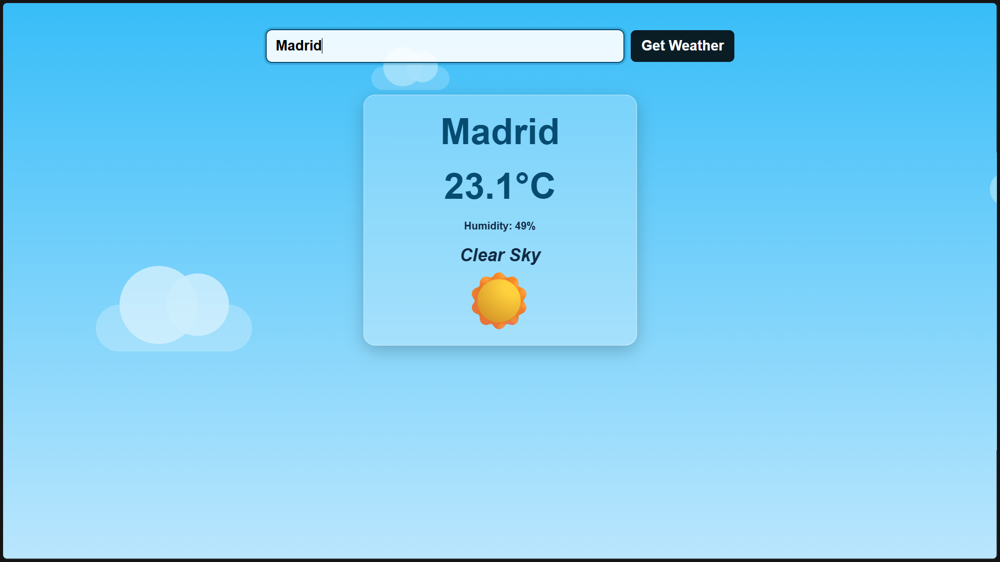
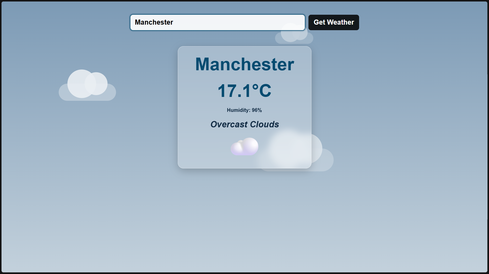
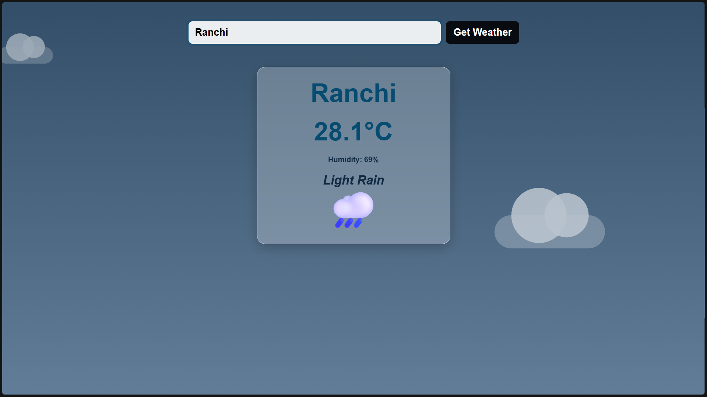

# Weather App

A simple weather application rebuilt from a first-year university hackathon project.

The app uses the OpenWeatherMap API to retrieve current weather information for a searched city and changes the page background according to the returned weather condition.

## Features

- Search for current weather by city
- Temperature displayed in Celsius
- Humidity
- Weather description
- Weather-condition emoji
- Seven weather-specific background themes:
  - Thunderstorm
  - Drizzle
  - Rain
  - Snow
  - Mist / atmosphere
  - Clear sky
  - Clouds
- Animated CSS cloud background
- Transparent glass-style weather card
- Loading state while the API request is running
- More specific error messages for invalid cities and API-key problems
- Responsive layout for mobile screens
- Reduced-motion support for accessibility

## Technologies

- HTML5
- CSS3
- JavaScript (ES6+)
- Fetch API
- OpenWeatherMap API

## Project Structure

```text
Weather-App/
├── index.html
├── style.css
├── script.js
├── README.md
├── .gitignore
└── screenshots/
```

## Running the Project

Because the application uses the OpenWeatherMap API, you need your own API key.

1. Create an OpenWeatherMap account and obtain an API key.
2. Open `script.js`.
3. Replace:

```javascript
const apiKey = "YOUR_OPENWEATHERMAP_API_KEY";
```

with your own key.
4. Open `index.html` in a browser, or use a local development server such as VS Code Live Server.

### API Key Warning

Do **not** commit a real API key to a public GitHub repository.

This project is a frontend-only learning project, so the browser must ultimately receive an API key to call the API directly. For a production application, API access should normally be handled through a backend/server-side layer and/or an appropriately restricted key.

If a key has already been exposed publicly, revoke or regenerate it through the API provider.

## How It Works

```text
User enters city
        ↓
Form submission
        ↓
JavaScript calls OpenWeatherMap
        ↓
API returns JSON
        ↓
JavaScript extracts weather data
        ↓
Weather ID is checked
        ↓
Background + emoji are selected
        ↓
Weather card is updated
```

## Weather Categories

| Weather ID | Category | Emoji |
|---|---|---|
| 200–299 | Thunderstorm | ⛈️ |
| 300–399 | Drizzle | 🌧️ |
| 500–599 | Rain | 🌧️ |
| 600–699 | Snow | ❄️ |
| 700–799 | Mist / atmosphere | 🌫️ |
| 800 | Clear | ☀️ |
| 801–809 | Clouds | ☁️ |

## Screenshots

Add screenshots of the application here after running it. For example:

```markdown



```

## Background

This project is a reconstruction and improvement of a weather app originally created for a university hackathon during my first year.

The original project was built as a small JavaScript/API project. This version keeps the original concept while cleaning up the project structure, improving the UI, adding responsive behavior, loading/error states, and making the background react to the weather returned by the API.

## Future Improvements

Possible future improvements include:

- Celsius/Fahrenheit toggle
- Wind speed and direction
- Feels-like temperature
- Weather forecast
- Current-location weather
- Weather icons/images
- Search history
- More detailed accessibility improvements

## License

This project is intended as a personal learning/portfolio project.
